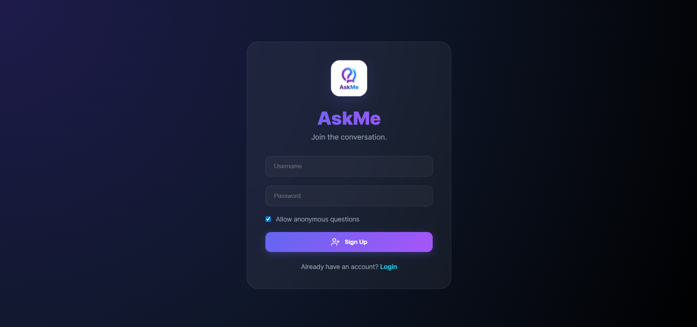

# 🌌 AskMe - Glassmorphic Q&A Platform

AskMe is a modern, high-fidelity Q&A platform built with **Spring Boot** and **React**. It features a stunning glassmorphic UI, real-time-like updates, and a persistent database.

## ✨ Features
- **Modern UI**: Full glassmorphism with dark mode, smooth animations, and neon accents.
- **Real-time Interaction**: Ask and answer questions with instant UI updates.
- **Global Feed**: See what's happening across the platform in a beautiful activity stream.
- **Secure Persistence**: Integrated with **H2 Database** for reliable data storage.
- **Responsive Design**: Optimized for both desktop and mobile viewing.

---

## 🚀 Getting Started

### 1. Prerequisites
- **Java 22** or higher
- **Node.js 20+**
- **Maven**

### 2. Run the Backend (Spring Boot)
```bash
cd AskMe
mvn spring-boot:run
```
*The API will start at `http://localhost:8080`*

### 3. Run the Frontend (React + Vite)
```bash
cd AskMe/frontend
npm install
npm run dev
```
*The UI will start at `http://localhost:5173`*

---

## 📂 Project Structure
```text
AskMe/
├── src/main/java/fm/       # Spring Boot Backend
│   ├── Auth/               # Registration & Login logic
│   ├── Questions/          # Q&A logic & Feed
│   └── Config/             # CORS & Security settings
├── frontend/               # React Frontend
│   ├── src/pages/          # Auth, Feed, and Profile views
│   ├── src/context/        # Global State (Auth)
│   └── src/index.css       # Glassmorphic Design System
└── data/                   # Persistent Database Storage
```

---

## 📸 Preview

### 🔐 Authentication
| Login | Register |
|-------|----------|
|  |  |

### 🌐 Global Feed


### 👤 User Experience
| Received Questions | Sent Questions |
|--------------------|----------------|
|  |  |

### 💬 Interaction
| Ask Someone | Answer Questions |
|-------------|------------------|
|  |  |
|  | |

---

## 🛠️ Built With
- **Backend**: Spring Boot 3, JPA, H2 Database, Lombok.
- **Frontend**: React 18, Vite, Framer Motion (Animations), Lucide (Icons), Vanilla CSS.

---
